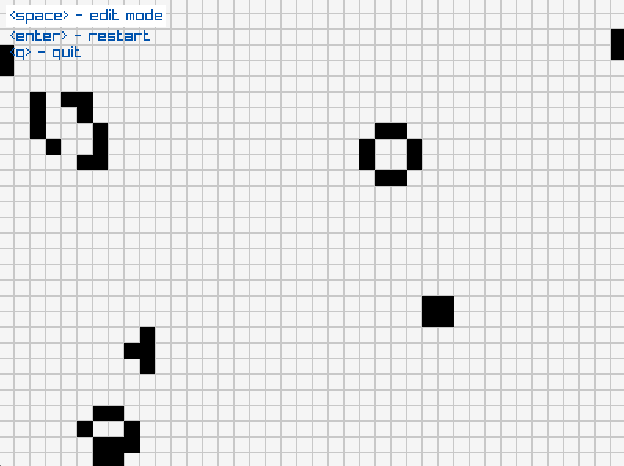
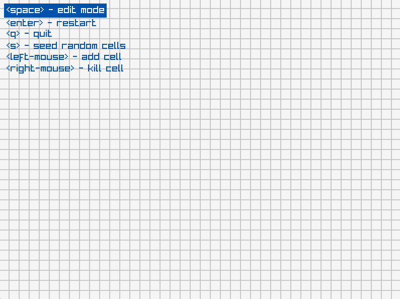
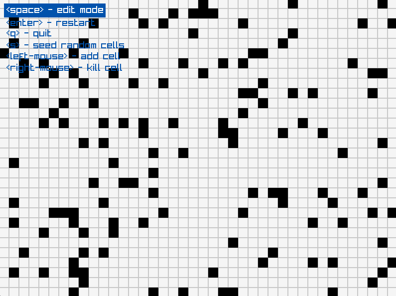

# Conway's Game of Life

[](https://github.com/claudemuller/life-c/actions/workflows/c.yml)

Conway's Game of Life written in C with [raylib](https://github.com/raysan5/raylib).



# Requirements

- [gcc](https://gcc.gnu.org/)
- or [clang](https://clang.llvm.org/)
- [make](https://www.gnu.org/software/make/)
- [raylib](https://github.com/raysan5/raylib)

# Simulation Interaction

The simulation starts in `edit` mode:



One can use the:
- `space` key to toggle between editing or running the simulation
- `right-mouse` button to add cells
- `left-mouse` button to remove cells
- `s` key to to seed the Petri dish with random cells



- `enter` key to restart with a clean Petri dish
- `q` key to quit

# Build

```bash
make build
```

# Run

```bash
make run
```

# Build a Debug Binary

```bash
make debug-build
```

# Start `lldb` or `gdb` With Debug Binary

```bash
make debug
```
